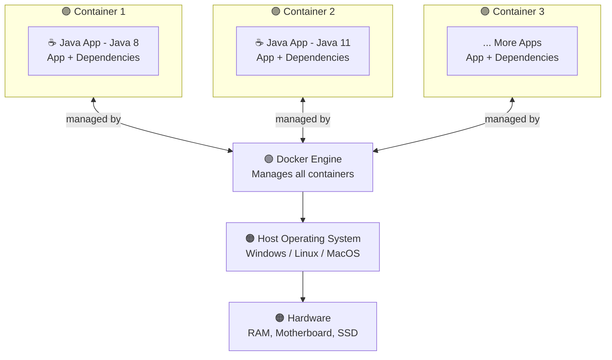
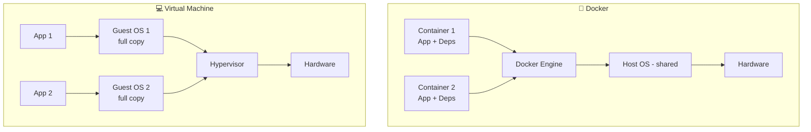

# 🐳 What is Docker?

Docker is an **open platform** for developing, shipping, and running applications.

Docker is a platform which **packages an application and all its dependencies** together in the form of **containers**.

---

## 🧱 Breaking It Down

### 📦 "Packages an application and all its dependencies"

When you build a Java Spring Boot app, it doesn't run in isolation. It needs:
- A specific **Java version** (e.g., JDK 17)
- Specific **libraries and dependencies** (e.g., from `pom.xml`)
- A specific **OS environment**
- Maybe a **MySQL database**, a **Redis cache**, etc.

Without Docker, when you send your code to someone else or deploy it to a server, you'd have to manually ensure all of these are installed and configured correctly. Docker **bundles everything together** — the app + its entire environment — into one portable unit called a **container**.

---

### 🚢 "Developing, Shipping, and Running"

Docker covers the full lifecycle of an application:

| Phase | What it means |
|-------|--------------|
| **Developing** | Build and run your app in a consistent environment locally |
| **Shipping** | Package the app as a Docker image and share/push it anywhere |
| **Running** | Run the same image on any machine — dev, test, or production |

> 💡 The same Docker container that runs on your laptop will run **identically** on a server in the cloud. No surprises.

---

## ❓ What Problems Does Docker Solve?

### 🔥 Problem 1: "It works on my machine"

The most classic developer problem. Your app runs perfectly on your laptop but breaks on your teammate's machine or on the production server — because they have a different OS, different Java version, or missing dependencies.

**Docker's solution:** Everyone runs the same container. Same environment, everywhere. ✅

---

### 🔥 Problem 2: Dependency Conflicts

Imagine you have two apps on the same server:
- App A needs **Java 8**
- App B needs **Java 17**

Installing both and managing them manually is a nightmare.

**Docker's solution:** Each app runs in its **own isolated container** with its own dependencies. They never conflict. ✅

---

### 🔥 Problem 3: Painful Setup for New Developers

A new developer joining a project might spend days setting up the local environment — installing the right DB version, configuring env variables, installing tools.

**Docker's solution:** One command — `docker-compose up` — and the entire app with all its services (DB, cache, backend) is running. ✅

---

### 🔥 Problem 4: Inconsistent Environments (Dev vs Prod)

Apps often behave differently in development vs production because the environments are set up differently.

**Docker's solution:** The same Docker image is used across **all environments** — dev, staging, and production. What you test is exactly what gets deployed. ✅

---

## 🆚 Docker vs Traditional Approach

| | Without Docker | With Docker |
|-|----------------|------------|
| Setup | Manual installation on every machine | One `Dockerfile` — build once, run anywhere |
| Dependencies | Installed globally, can conflict | Isolated per container |
| Environment consistency | "Works on my machine" 😤 | Same everywhere ✅ |
| Deployment | Complex, error-prone | Simple `docker run` |
| Scaling | Hard to replicate environments | Spin up multiple containers instantly |

---

## 🌍 What is an "Environment" for an Application?

You've heard this word everywhere — *"it works in my environment"*, *"deploy to production environment"*, *"set up your local environment"*. Here's what it actually means:

An **environment** is the complete setup that your application needs in order to run. It's not just your code — it's everything surrounding your code that makes it work.

Think of it like this: your Spring Boot app is a **plant** 🌱. The environment is the **soil, sunlight, water, and pot** it needs to survive. Change any of those, and the plant might not grow the same way.

For a real application, the environment includes:

| Component | Example |
|-----------|---------|
| **Operating System** | Windows 11, Ubuntu 22.04, macOS |
| **Runtime** | JDK 17, Node.js 18, Python 3.10 |
| **Dependencies** | Libraries from `pom.xml`, `package.json` |
| **Database** | MySQL 8.0, PostgreSQL 15 |
| **Configuration** | Port numbers, DB credentials, API keys |
| **Other services** | Redis, Kafka, RabbitMQ |

### 🏠 Types of Environments

In a real software project, there are typically multiple environments:

| Environment | Purpose | Who uses it |
|------------|---------|------------|
| **Local / Dev** | Writing and testing code | You (the developer) |
| **Testing / QA** | Running automated tests | QA team, CI/CD pipelines |
| **Staging** | Final check before going live | Testers, product team |
| **Production** | The live app real users access | Everyone |

> ⚠️ The classic problem: code works in **dev** but breaks in **production** because the environments were set up differently — different Java version, different DB version, different config values. Docker solves this by making all environments identical.

---

## 🔑 What are Environment Variables?

Environment variables (often called **env vars**) are **key-value pairs** stored outside your code that configure how your application behaves in a specific environment.

Instead of hardcoding sensitive or environment-specific values directly in your code, you store them as variables that the app reads at runtime.

### 🔴 Bad Practice — Hardcoding values directly in code:

```java
// application.properties — hardcoded, dangerous!
spring.datasource.url=jdbc:mysql://localhost:3306/myhiber
spring.datasource.username=root
spring.datasource.password=kshitijY18!
```

Problems with this:
- If you push this to GitHub, **your password is exposed publicly** 😱
- When you deploy to production, the DB URL will be different — you'd have to change code every time
- Everyone on your team would use the same credentials

### 🟢 Good Practice — Using environment variables:

```java
// application.properties — reads from environment variables
spring.datasource.url=${DB_URL}
spring.datasource.username=${DB_USERNAME}
spring.datasource.password=${DB_PASSWORD}
```

Now `DB_URL`, `DB_USERNAME`, and `DB_PASSWORD` are **environment variables** — set differently on each machine/environment, never hardcoded in code.

---

### 🖥️ How to Set Environment Variables

**On Linux/macOS (terminal):**
```bash
export DB_URL=jdbc:mysql://localhost:3306/myhiber
export DB_USERNAME=root
export DB_PASSWORD=kshitijY18!
```

**On Windows (Command Prompt):**
```cmd
set DB_URL=jdbc:mysql://localhost:3306/myhiber
set DB_USERNAME=root
set DB_PASSWORD=kshitijY18!
```

**In a `.env` file (used with Docker Compose):**
```env
DB_URL=jdbc:mysql://localhost:3306/myhiber
DB_USERNAME=root
DB_PASSWORD=kshitijY18!
```

**In Docker run command:**
```bash
docker run -e DB_URL=jdbc:mysql://localhost:3306/myhiber \
           -e DB_USERNAME=root \
           -e DB_PASSWORD=kshitijY18! \
           my-spring-app
```

---

### 🧠 Why Environment Variables Matter in Docker

In Docker, environment variables are how you **configure a container without changing the image**. The same image can be used for dev, staging, and production — just pass different env vars:

| Variable | Dev Value | Production Value |
|----------|----------|-----------------|
| `DB_URL` | `jdbc:mysql://localhost:3306/devdb` | `jdbc:mysql://prod-server:3306/proddb` |
| `DB_PASSWORD` | `root` | `$uP3r$3cur3P@ss` |
| `SERVER_PORT` | `8081` | `80` |

> 💡 **Rule of thumb:** Anything that **changes between environments** or is **sensitive** (passwords, API keys, tokens) should be an environment variable — never hardcoded in your source code.

> 🔒 Always add `.env` files to `.gitignore` so they are never pushed to GitHub!

---

## 🏗️ Understanding Docker Architecture

### 📊 Architecture Diagram



```
┌─────────────────┐  ┌─────────────────┐  ┌─────────────────┐
│   Container 1   │  │   Container 2   │  │   Container 3   │
│  Java App       │  │  Java App       │  │  More Apps      │
│  (Java 8)       │  │  (Java 11)      │  │  (...)          │
└────────┬────────┘  └────────┬────────┘  └────────┬────────┘
         │                    │                    │
         └────────────────────┴────────────────────┘
                              │  managed by
                              ▼
              ┌───────────────────────────────┐
              │         Docker Engine         │
              └───────────────┬───────────────┘
                              │
                              ▼
              ┌───────────────────────────────┐
              │    Host Operating System      │
              │   (Windows / Linux / macOS)   │
              └───────────────┬───────────────┘
                              │
                              ▼
              ┌───────────────────────────────┐
              │           Hardware            │
              │     (RAM, Motherboard, SSD)   │
              └───────────────────────────────┘
```

---

### 🔍 Breaking Down Each Layer

#### 🟣 Containers (Top Layer)
- Each container is a **completely isolated box** that holds your app + everything it needs to run.
- **Container 1** has a Java App running on **Java 8** with its own dependencies.
- **Container 2** has a Java App running on **Java 11** with its own dependencies.
- They both run **simultaneously on the same machine** without conflicting — because each container is isolated.
- You can have as many containers as you want (Container 3, 4, 5...).

> 💡 This is how Docker solves the **Java 8 vs Java 11** conflict — each app gets its own container with its own Java version. They never see each other.

---

#### 🟢 Docker Engine (Middle Layer)
- The **brain of Docker** — it creates, runs, stops, and manages all containers.
- It sits between the containers and the Host OS.
- Also manages tools installed on the host like Python 3, Eclipse, etc.
- When you run `docker run` or `docker build`, you're talking to the Docker Engine.

---

#### 🟠 Host Operating System
- The **actual OS** running on your machine — Windows, Linux, or macOS.
- The Docker Engine runs on top of the Host OS.
- Containers share the Host OS **kernel** but are still isolated from each other in terms of processes and file systems.

> 💡 This is different from a **Virtual Machine (VM)** — which has its own separate full OS per instance. Containers are much lighter because they share the Host OS kernel.

---

#### 🟠 Hardware (Bottom Layer)
- The **physical machine** — RAM, Motherboard, SSD, CPU.
- Everything runs on top of this — Host OS sits on hardware, Docker Engine on OS, containers on the engine.
- Containers never directly access hardware — they go through Docker Engine → Host OS → Hardware.

---

### 🆚 Docker Containers vs Virtual Machines



```
       🐳 DOCKER                        💻 VIRTUAL MACHINE
─────────────────────────       ──────────────────────────────
 ┌───────────┐ ┌───────────┐    ┌──────────────┐ ┌──────────────┐
 │Container 1│ │Container 2│    │    App 1     │ │    App 2     │
 │ App + Deps│ │ App + Deps│    ├──────────────┤ ├──────────────┤
 └─────┬─────┘ └─────┬─────┘    │  Guest OS 1  │ │  Guest OS 2  │
       └──────┬──────┘          │  (full copy) │ │  (full copy) │
              ▼                 └──────┬───────┘ └──────┬───────┘
     ┌─────────────────┐               └────────┬───────┘
     │  Docker Engine  │                        ▼
     ├─────────────────┤             ┌───────────────────┐
     │  Host OS        │             │    Hypervisor     │
     │  (shared)       │             └─────────┬─────────┘
     ├─────────────────┤                       ▼
     │  Hardware       │             ┌───────────────────┐
     └─────────────────┘             │     Hardware      │
                                     └───────────────────┘
```

| | Docker Containers | Virtual Machines |
|-|------------------|-----------------|
| **OS** | Shares Host OS kernel | Each VM has its own full OS |
| **Size** | MBs (lightweight) | GBs (heavy) |
| **Startup** | Seconds | Minutes |
| **Isolation** | Process-level | Full OS-level |
| **Performance** | Near-native | Slower (overhead) |
| **Use case** | Microservices, apps | Full OS isolation needed |

---

## 🧠 Key Concepts to Remember

- **Docker** = The platform/tool
- **Container** = A running, isolated instance of your app + its environment
- **Image** = A blueprint/snapshot used to create containers (like a class vs object in Java)
- **Dockerfile** = A script that defines how to build a Docker image
- **Docker Hub** = A registry where Docker images are stored and shared (like GitHub for images)

> 🎯 **One-liner to remember:** Docker is like a shipping container for software — you pack everything inside, and it runs the same way no matter which ship (server) it's on.