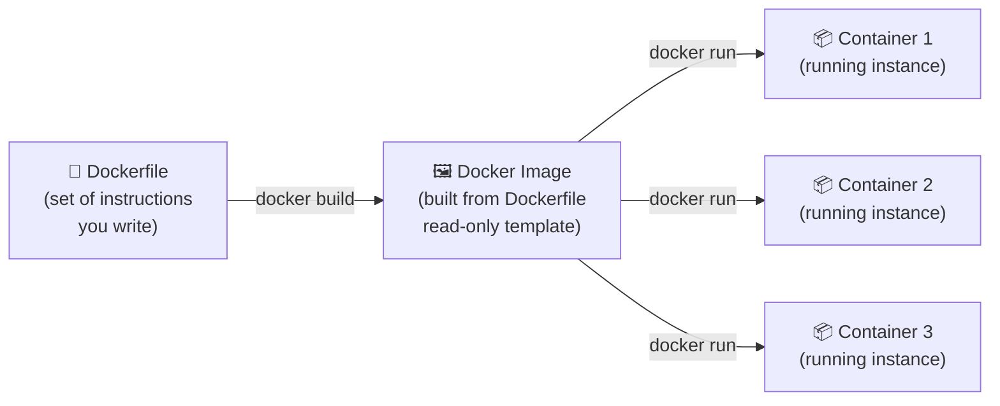
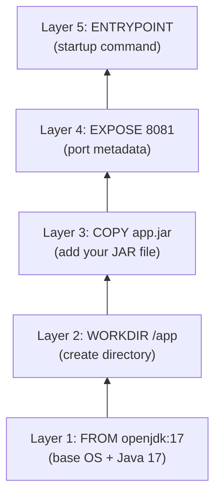
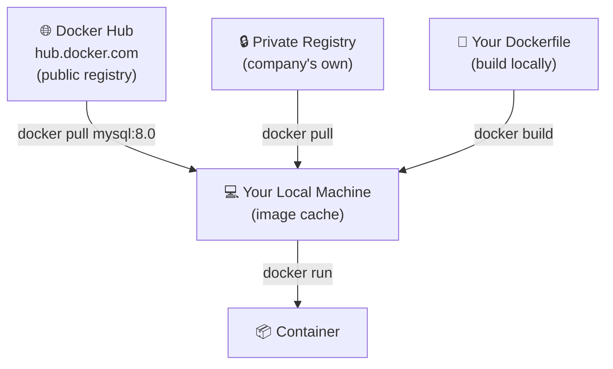
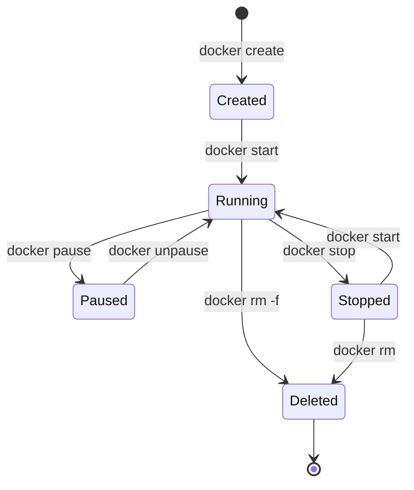
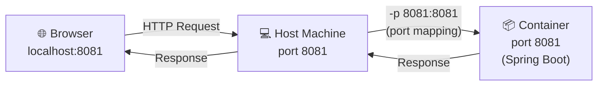
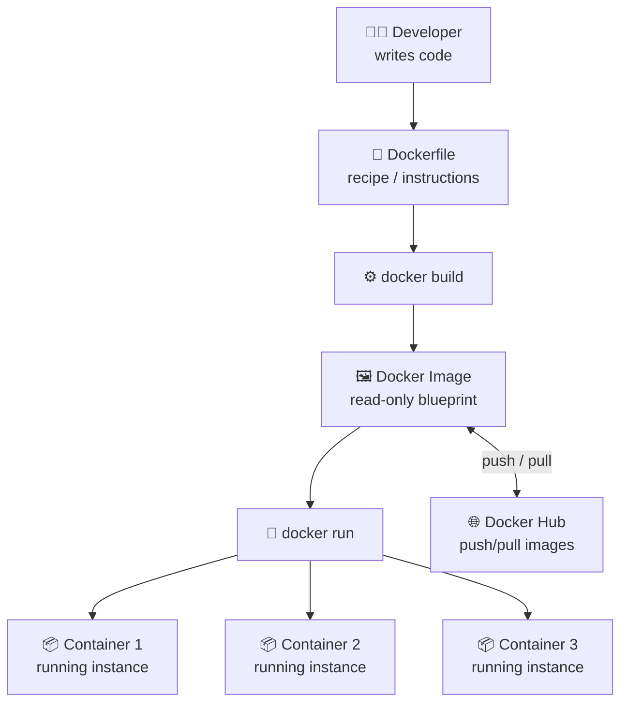

# 🐳 Dockerfile, Image and Container

The three most fundamental concepts in Docker. Understanding how these three relate to each other is the foundation of everything else in Docker.

---

> ### 📝 Note: What is WSL?
>
> If you are running Docker on **Windows**, you've likely seen the term **WSL** — and Docker Desktop even requires it. Here's what it is:
>
> **WSL stands for Windows Subsystem for Linux.**
>
> It is a feature built into Windows that lets you run a **real Linux environment directly inside Windows** — without needing a separate virtual machine or dual boot. You get a full Linux terminal (Ubuntu, Debian, etc.) running side by side with Windows.
>
> **Why does Docker need WSL on Windows?**
> Docker containers are built on **Linux kernel features** (like namespaces and cgroups) for isolation. Windows doesn't have these natively. So Docker Desktop uses WSL 2 as a lightweight Linux layer under the hood to provide these capabilities — without you having to install a full separate OS.
>
> ```
> Your Windows Machine
>     └── WSL 2 (lightweight Linux kernel built into Windows)
>             └── Docker Engine (runs here, using Linux kernel features)
>                     └── Your Containers (isolated Linux environments)
> ```
>
> **WSL 1 vs WSL 2:**
>
> | | WSL 1 | WSL 2 |
> |-|-------|-------|
> | Linux kernel | Translated (not real) | Real Linux kernel |
> | Docker support | ❌ Not supported | ✅ Fully supported |
> | Performance | Slower | Near-native speed |
> | File system speed | Good | Excellent |
>
> **In short:** WSL 2 is what makes Docker work natively and fast on Windows. If you're on **Linux or macOS**, Docker uses the OS kernel directly and WSL is not needed at all.

---


## 🔗 How They Relate — The Big Picture

Before diving deep, understand this one flow:



> 💡 **One Dockerfile → One Image → Many Containers**
> The same image can be used to spin up as many containers as you want.

---

## 🧠 Java Analogy (Since you know Java!)

| Docker | Java |
|--------|------|
| `Dockerfile` | Source code (`.java` file) |
| `Docker Image` | Compiled `.class` / `.jar` file |
| `Container` | Running instance of the program (JVM executing it) |

Just like you write `.java` → compile to `.class` → run multiple instances of the program, you write `Dockerfile` → build to `Image` → run multiple containers from it.

---
---

# 📄 Dockerfile

## What is it?

A **Dockerfile** is a plain text file (no extension, literally named `Dockerfile`) that contains a set of **step-by-step instructions** that Docker reads to **build an image**.

Think of it as a **recipe** 🍳 — it tells Docker:
- What base to start from (e.g., a machine with Java already installed)
- What files to copy into the image
- What commands to run during setup
- What port to expose
- What command to run when a container starts

---

## 📋 A Real Dockerfile for Your Spring Boot App

```dockerfile
# Step 1: Start from an official image that already has Java 17
FROM openjdk:17-jdk-slim

# Step 2: Set a working directory inside the container
WORKDIR /app

# Step 3: Copy your built JAR file into the container
COPY target/springrest-0.0.1-SNAPSHOT.jar app.jar

# Step 4: Tell Docker which port your app runs on
EXPOSE 8081

# Step 5: Command to run when the container starts
ENTRYPOINT ["java", "-jar", "app.jar"]
```

---

## 🔍 Every Dockerfile Instruction Explained

### `FROM` — The Starting Point

```dockerfile
FROM openjdk:17-jdk-slim
```

- Every Dockerfile **must start with `FROM`**.
- It defines the **base image** — a pre-built image you start on top of.
- `openjdk:17-jdk-slim` means: *"Give me a Linux machine that already has Java 17 installed, in a slim/minimal size."*
- You're not building from scratch — you're standing on the shoulders of existing images.
- Base images come from **Docker Hub** (like GitHub but for images).

> 💡 Think of it like `extends` in Java — you inherit everything from the base and add on top.

---

### `WORKDIR` — Set the Working Directory

```dockerfile
WORKDIR /app
```

- Sets the **current working directory** inside the container for all subsequent commands.
- If `/app` doesn't exist, Docker creates it automatically.
- All `COPY`, `RUN`, `CMD` instructions after this will execute relative to `/app`.
- Like doing `cd /app` and staying there.

---

### `COPY` — Copy Files Into the Image

```dockerfile
COPY target/springrest-0.0.1-SNAPSHOT.jar app.jar
```

- Copies files from your **local machine** (left side) into the **container's file system** (right side).
- `target/springrest-0.0.1-SNAPSHOT.jar` → your locally built Spring Boot JAR file.
- `app.jar` → what it will be named inside the container (in `/app/app.jar`).
- You can copy entire folders too: `COPY src/ /app/src/`

---

### `RUN` — Execute Commands During Build

```dockerfile
RUN apt-get update && apt-get install -y curl
```

- Executes a shell command **at build time** (when creating the image, not when running the container).
- Used for installing software, creating directories, setting permissions, etc.
- Each `RUN` creates a new **layer** in the image (more on layers below).
- You can chain commands with `&&` to keep layers minimal.

> ⚠️ `RUN` runs **once during build**. It's not run every time a container starts.

---

### `EXPOSE` — Document the Port

```dockerfile
EXPOSE 8081
```

- **Documents** which port the application inside the container listens on.
- Does **not** actually open or publish the port — it's just metadata/documentation.
- The actual port mapping happens when you run the container with `-p`:
  ```bash
  docker run -p 8081:8081 my-spring-app
  # format: -p <host-port>:<container-port>
  ```

---

### `ENTRYPOINT` — The Command That Runs on Container Start

```dockerfile
ENTRYPOINT ["java", "-jar", "app.jar"]
```

- Defines the **command that runs every time a container starts** from this image.
- Uses JSON array format (exec form) — preferred over shell form.
- This is like the `main()` method of your container — the starting point.
- `java -jar app.jar` tells the JVM to run your Spring Boot JAR file.

> 💡 **`ENTRYPOINT` vs `CMD`:**
> - `ENTRYPOINT` — fixed command, always runs, cannot be easily overridden
> - `CMD` — default command, can be overridden when running the container
> - Common pattern: use `ENTRYPOINT` for the executable, `CMD` for default arguments

---

### `ENV` — Set Environment Variables

```dockerfile
ENV SPRING_PROFILES_ACTIVE=production
ENV SERVER_PORT=8081
```

- Sets **environment variables** inside the container.
- These are available to your application at runtime.
- Can be overridden when running the container with `-e` flag.

---

### `ARG` — Build-time Variables

```dockerfile
ARG JAR_FILE=target/*.jar
COPY ${JAR_FILE} app.jar
```

- Like `ENV` but only available **during the build process**, not at runtime.
- Useful for making Dockerfiles flexible and reusable.

---

## 🧱 Docker Image Layers

Every instruction in a Dockerfile creates a **layer** in the image:



- Layers are **cached** — if nothing changed in a layer, Docker reuses the cached version on next build (much faster rebuilds).
- This is why instruction **order matters** — put things that change frequently (like `COPY app.jar`) near the bottom, so Docker can reuse the stable layers above.

---

## ⚡ Building a Dockerfile

```bash
# Build an image from Dockerfile in current directory
docker build -t my-spring-app:1.0 .

# -t = tag (name:version)
# . = look for Dockerfile in current directory
```

---
---

# 🖼️ Docker Image

## What is it?

A **Docker Image** is a **read-only template** that is built from a Dockerfile. It contains:
- The **base OS** layer (e.g., slim Linux)
- The **runtime** (e.g., Java 17)
- Your **application code** (e.g., the Spring Boot JAR)
- All **dependencies and configuration**

An image is like a **snapshot** — a frozen, static blueprint. It never changes once built. To update it, you rebuild from the Dockerfile.

---

## 🔍 Key Characteristics of a Docker Image

### 1. 📖 Read-Only
- An image itself **cannot be modified** after it's built.
- When you run a container, Docker adds a thin **writable layer** on top of the image for that container's changes.
- The underlying image stays untouched.

### 2. 🧅 Layered Structure
- An image is made up of **multiple stacked layers**, each corresponding to a Dockerfile instruction.
- Layers are shared between images — if two images both use `openjdk:17`, they share that layer on disk (saves space).

### 3. 🏷️ Tagged with a Name and Version
- Images are identified by `name:tag` format.
- Example: `my-spring-app:1.0`, `mysql:8.0`, `openjdk:17-jdk-slim`
- `latest` is the default tag if none is specified — but relying on `latest` in production is bad practice.

### 4. 📦 Portable
- An image built on your Windows machine will run identically on a Linux server.
- This is the "build once, run anywhere" promise of Docker.

---

## 🌐 Where Do Images Come From?



**1. Docker Hub (Public Registry)**
- The default registry — like GitHub but for images.
- Millions of official and community images: `mysql`, `nginx`, `openjdk`, `redis`, `postgres`, etc.
- Pull any image: `docker pull mysql:8.0`

**2. Build Locally from Dockerfile**
- Write your own `Dockerfile` and build: `docker build -t my-app .`

**3. Private Registry**
- Companies host their own private registries (AWS ECR, Google GCR, Azure ACR) for proprietary images.

---

## 🛠️ Common Image Commands

```bash
# Pull an image from Docker Hub
docker pull mysql:8.0

# List all images on your machine
docker images

# Build an image from Dockerfile
docker build -t my-spring-app:1.0 .

# Tag an existing image
docker tag my-spring-app:1.0 my-spring-app:latest

# Push image to Docker Hub
docker push yourusername/my-spring-app:1.0

# Remove an image
docker rmi my-spring-app:1.0

# View image layers/history
docker history my-spring-app:1.0

# Inspect image metadata
docker inspect my-spring-app:1.0
```

---
---

# 📦 Docker Container

## What is it?

A **Docker Container** is a **running instance of a Docker Image**.

If an image is the blueprint, the container is the actual building constructed from that blueprint. The container is the live, running, isolated environment where your application actually executes.

---

## 🔍 Key Characteristics of a Container

### 1. ⚡ Isolated
- Each container runs in complete **isolation** — its own file system, its own network, its own processes.
- Containers on the same machine cannot interfere with each other.
- Container 1 running Java 8 has no idea Container 2 running Java 11 even exists.

### 2. 🔄 Writable Layer
- While the image is read-only, Docker adds a thin **writable layer** on top when creating a container.
- All changes the container makes (log files, uploaded files, DB data) go into this writable layer.
- When the container is deleted, this writable layer is gone too — data is not persistent by default.
- To persist data, you use **Docker Volumes** (covered later).

### 3. 🪶 Lightweight
- Containers share the Host OS kernel — they don't carry a full OS.
- A container can start in **milliseconds** vs minutes for a VM.
- You can run dozens of containers on a regular laptop.

### 4. 🔁 Ephemeral by Default
- Containers are designed to be **temporary** — start, do their job, stop, be replaced.
- This is by design for scalability — if a container crashes, just spin up a new one.

---

## 🔄 Container Lifecycle



| State | Description |
|-------|-------------|
| **Created** | Container created but not yet started |
| **Running** | Container is active and processes are executing |
| **Paused** | Container processes are temporarily frozen |
| **Stopped** | Container has stopped, but still exists on disk |
| **Deleted** | Container is permanently removed |

---

## 🛠️ Common Container Commands

```bash
# Run a container from an image
docker run -d -p 8081:8081 --name my-app my-spring-app:1.0
# -d = detached (run in background)
# -p = port mapping host:container
# --name = give container a name

# List running containers
docker ps

# List all containers (including stopped)
docker ps -a

# Stop a running container
docker stop my-app

# Start a stopped container
docker start my-app

# Restart a container
docker restart my-app

# Remove a container (must be stopped first)
docker rm my-app

# Force remove a running container
docker rm -f my-app

# View container logs
docker logs my-app
docker logs -f my-app  # -f = follow (live logs)

# Open a terminal inside a running container
docker exec -it my-app /bin/bash
# -i = interactive, -t = terminal

# View container resource usage
docker stats my-app

# Inspect container details
docker inspect my-app
```

---

## 🔌 Port Mapping — Explained

When you run a container, the app inside listens on a port **inside the container's isolated network**. To access it from your browser/Postman, you need to **map** a port on your host machine to the container's port:

```bash
docker run -p 8081:8081 my-spring-app
#            ↑     ↑
#       host port  container port
```



You could also map to different ports:
```bash
docker run -p 9090:8081 my-spring-app
# Access via localhost:9090, but Spring Boot still runs on 8081 inside
```

---

## 🆚 Image vs Container — Side by Side

| | Docker Image | Docker Container |
|-|-------------|-----------------|
| **What it is** | Blueprint / Template | Running instance of the blueprint |
| **State** | Static, read-only | Dynamic, running |
| **Created by** | `docker build` | `docker run` |
| **Can be modified?** | No (rebuild needed) | Yes (writable layer) |
| **Stored on disk?** | Yes (permanently) | Yes (until `docker rm`) |
| **Java equivalent** | `.class` / `.jar` file | JVM running that `.jar` |
| **Multiple instances?** | No (one image) | Yes (many containers from one image) |

---

## 🧠 Final Summary — All Three Together



| Concept | One-liner |
|---------|-----------|
| **Dockerfile** | The recipe — instructions to build an image |
| **Docker Image** | The blueprint — read-only, built from Dockerfile |
| **Docker Container** | The running app — live instance created from image |

> 🎯 **Remember:** You write the `Dockerfile` once → build the `Image` once → run as many `Containers` as you need, anywhere in the world.