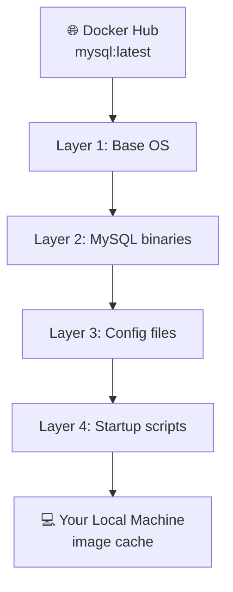
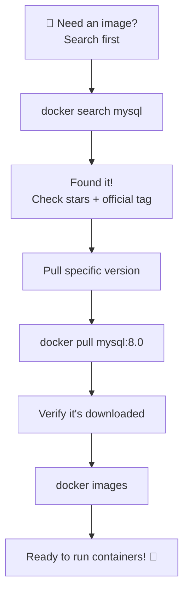
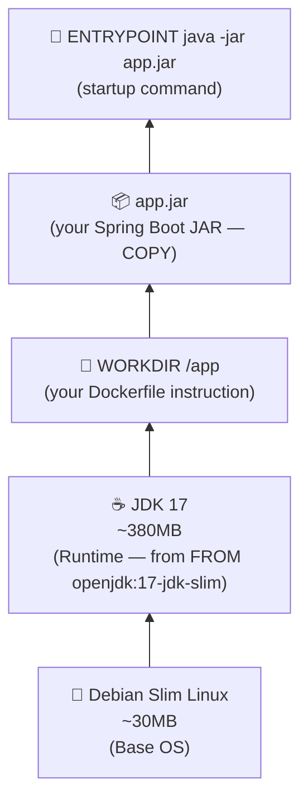

# 🐳 Docker Basic Commands

A complete breakdown of the most essential Docker CLI commands — what they do, how to use them, and what the output means.

---

> 💡 **How to read this file:**
> - `<Image_Name>` → replace with actual image name e.g. `mysql`, `nginx`, `openjdk`
> - `<Version / Tag>` → replace with actual version e.g. `8.0`, `latest`, `17-jdk-slim`
> - `//` → these are just comments, not part of the actual command

---

## 1. 🔍 Check Docker Version

```bash
docker -v
# or
docker --version
```

### What it does:
- Confirms that Docker is **installed** on your machine.
- Shows the **version number** of Docker currently installed.

### Example Output:
```
Docker version 24.0.5, build ced0996
```

### When to use it:
- First thing to run after installing Docker — to verify installation was successful.
- When debugging issues — version mismatches can cause unexpected behaviour.
- When following tutorials — some features require specific Docker versions.

> 💡 `-v` is the short form, `--version` is the long form. Both do exactly the same thing. This is a common CLI convention — most tools support both.

---

## 2. 📥 Pull an Image

```bash
docker pull <Image_Name>
```

### What it does:
- **Downloads** a Docker image from **Docker Hub** (the default public registry) to your local machine.
- If no version/tag is specified, Docker automatically pulls the **`latest`** tag.
- The image is stored in your local image cache so you can create containers from it.

### Example:
```bash
docker pull mysql
# pulls mysql:latest (most recent version)

docker pull nginx
# pulls nginx:latest

docker pull openjdk
# pulls openjdk:latest
```

### Example Output:
```
Using default tag: latest
latest: Pulling from library/mysql
e1caac4eb9d2: Pull complete
...
Status: Downloaded newer image for mysql:latest
docker.io/library/mysql:latest
```

### What each line means:
| Output | Meaning |
|--------|---------|
| `Using default tag: latest` | No tag was specified, so Docker defaults to `latest` |
| `Pulling from library/mysql` | Downloading from the official MySQL repo on Docker Hub |
| `e1caac4eb9d2: Pull complete` | One image layer downloaded successfully |
| `Status: Downloaded newer image` | Image pulled fresh for the first time |
| `Status: Image is up to date` | You already had the latest version, nothing downloaded |

### How layers work during pull:


> ⚡ **Layers are cached!** If you pull another image that shares a layer with one you already have (e.g., both use the same base OS), Docker skips downloading that layer — saving time and disk space.

---

## 3. 📥 Pull an Image with a Specific Version / Tag

```bash
docker pull <Image_Name>:<Version / Tag>
```

### What it does:
- Same as `docker pull` but downloads a **specific version** of the image instead of `latest`.
- The version/tag comes after the `:` (colon).
- Tags are defined by the image publisher on Docker Hub.

### Example:
```bash
docker pull mysql:8.0
# pulls MySQL version 8.0 specifically

docker pull openjdk:17-jdk-slim
# pulls OpenJDK 17, slim variant (smaller size)

docker pull openjdk:11
# pulls OpenJDK 11

docker pull nginx:1.25-alpine
# pulls Nginx 1.25, Alpine Linux variant (very small)
```

### Why use a specific version instead of `latest`?

| Using `latest` | Using specific version |
|---------------|----------------------|
| Always gets newest version | Gets exactly what you specify |
| Can break your app if new version has changes | Predictable, stable |
| Good for quick experiments | ✅ Recommended for real projects |
| `latest` today ≠ `latest` tomorrow | Same image every time |

> ⚠️ **Best Practice:** Always pin to a specific version in production. If you use `mysql:latest` today and someone rebuilds the image tomorrow after MySQL releases a new version, your app might break. Use `mysql:8.0` to be safe.

### Common Tags You'll See:
| Tag | Meaning |
|-----|---------|
| `latest` | Most recent stable release (default) |
| `8.0`, `17`, `3.10` | Specific version number |
| `slim` | Smaller image, fewer tools pre-installed |
| `alpine` | Based on Alpine Linux — extremely small (5MB base) |
| `lts` | Long Term Support version |
| `jdk` vs `jre` | Full Java Dev Kit vs just the Runtime Environment |

---

## 4. 🗂️ See All Local Images

```bash
docker images
```

### What it does:
- Lists **all Docker images** currently stored on your local machine.
- Shows useful metadata about each image.

### Example Output:
```
REPOSITORY    TAG          IMAGE ID       CREATED        SIZE
mysql         8.0          3218b38490ce   2 weeks ago    516MB
openjdk       17-jdk-slim  1b6a3e3b24e7   3 weeks ago    409MB
nginx         latest       a8758716bb6a   4 weeks ago    187MB
my-spring-app 1.0          f8d7e1c92b1a   2 days ago     298MB
```

### What each column means:
| Column | Meaning |
|--------|---------|
| `REPOSITORY` | The image name (e.g., `mysql`, `nginx`, your custom image) |
| `TAG` | The version/tag of the image |
| `IMAGE ID` | Unique identifier for the image (shortened hash) |
| `CREATED` | When the image was built/pulled |
| `SIZE` | Disk space the image takes up |

### Useful variations:
```bash
# Show only image IDs (useful for scripting)
docker images -q

# Show all images including intermediate layers
docker images -a

# Filter images by name
docker images mysql
```

---

## 5. 🔎 Search for an Image on Docker Hub

```bash
docker search <Image_Name>
```

### What it does:
- **Searches Docker Hub** for images matching the given name — directly from your terminal.
- Saves you from opening a browser to visit hub.docker.com.
- Shows official images, community images, ratings, and descriptions.

### Example:
```bash
docker search mysql
docker search java
docker search springboot
```

### Example Output:
```
NAME                            DESCRIPTION                                     STARS     OFFICIAL
mysql                           MySQL is a widely used, open-source relation…   14893     [OK]
mariadb                         MariaDB Server is a high performing open sou…   5673      [OK]
bitnami/mysql                   Bitnami MySQL Docker Image                      105
mysql/mysql-server              Optimized MySQL Server Docker images.           971
linuxserver/mysql               A Mysql container, brought to you by LinuxSe…   38
```

### What each column means:
| Column | Meaning |
|--------|---------|
| `NAME` | Image name (use this in `docker pull`) |
| `DESCRIPTION` | Brief description of the image |
| `STARS` | Community rating — higher = more trusted/popular |
| `OFFICIAL` | `[OK]` means it's an **official image** maintained by the software vendor |

### Official vs Community Images:
| | Official Images | Community Images |
|-|----------------|-----------------|
| **Maintained by** | The software vendor (e.g., MySQL team) | Individual developers or organizations |
| **Security** | Regularly updated, security-patched | Varies |
| **Trust** | ✅ Highly trusted | Use with caution |
| **Example** | `mysql`, `nginx`, `openjdk` | `bitnami/mysql`, `linuxserver/mysql` |

> ✅ **Always prefer Official images** (marked `[OK]`) when available — they are maintained by the actual software teams and regularly security-patched.

### Filter search results:
```bash
# Show only official images
docker search --filter "is-official=true" mysql

# Show images with at least 100 stars
docker search --filter "stars=100" mysql

# Limit results to top 5
docker search --limit 5 mysql
```

---

## 🧠 Quick Reference — All Commands

| Command | What it does |
|---------|-------------|
| `docker -v` | Check Docker version |
| `docker --version` | Check Docker version (long form) |
| `docker pull <name>` | Download latest version of image |
| `docker pull <name>:<tag>` | Download specific version of image |
| `docker images` | List all local images |
| `docker images -q` | List only image IDs |
| `docker search <name>` | Search Docker Hub for images |
| `docker search --filter "is-official=true" <name>` | Search for official images only |

---

## 🔄 Typical Workflow Using These Commands



```bash
# Step 1 — Search for the image
docker search mysql

# Step 2 — Pull the specific version you need
docker pull mysql:8.0

# Step 3 — Verify it's on your machine
docker images

# Step 4 — You're ready to create containers from it!
docker run mysql:8.0
```

---
---

## 📝 Concept Clarity: What is "Base OS"?

> When we say an image has a **Base OS**, do we mean the Host Machine's OS? Or the runtime like Java?
> **Neither.** Base OS, Host OS, and Runtime are three completely different things.

---

### 🖥️ Host OS
The OS **physically running on your machine** — your Windows, Ubuntu, or macOS. This is what you installed on your laptop. Docker Engine runs on top of this.

---

### 📦 Base OS (inside the image)
A **minimal Linux OS bundled inside the Docker image itself**. It is NOT your machine's OS — it's a tiny, stripped-down Linux (like Ubuntu, Debian, or Alpine) that gets packaged into every image as the bottom-most foundation layer.

Think of it like this:

```
Your Laptop (Windows / macOS)       ← Host OS
    └── Docker Engine
            └── Container
                    └── Alpine Linux (5MB!)   ← Base OS (inside the image)
                            └── Java 17       ← Runtime
                                    └── Your Spring Boot App
```

---

### 🤔 Why Does the Image Need Its Own OS Inside It?

Because containers need a **consistent Linux foundation** to run on — regardless of what the Host OS is.

- If you're on **Windows** and your teammate is on **macOS**, the container still behaves identically because it carries its own Base OS inside it.
- The Base OS provides basic tools like file system structure, package managers (`apt`, `apk`), and system libraries that your runtime (Java, Python, etc.) depends on to work correctly.

---

### 🆚 Host OS vs Base OS vs Runtime — Side by Side

| | Host OS | Base OS | Runtime |
|-|---------|---------|---------|
| **What** | Your machine's OS | Tiny Linux inside the image | Java, Python, Node.js |
| **Where** | Physical machine | Inside Docker image (bottom layer) | Inside Docker image, on top of Base OS |
| **Example** | Windows 11, macOS | Alpine Linux, Debian slim | JDK 17, Python 3.10 |
| **Size** | Full OS (GBs) | 5MB – 50MB | 100MB – 400MB |
| **Who installs it** | You | Comes with base image (`FROM`) | You specify in `FROM` or `RUN` |
| **Shared?** | Shared by Docker Engine | Bundled per image | Bundled per image |

---

### 🔍 Connecting It Back to Your Dockerfile

```dockerfile
FROM openjdk:17-jdk-slim
```

This one line pulls **two things bundled together**:
- A **slim Debian Linux** (the Base OS) → ~30MB
- **JDK 17** installed on top of it (the Runtime) → ~380MB

If you wanted to be more explicit, you could split it into two steps:

```dockerfile
FROM debian:slim           # ← just the Base OS
RUN apt-get install java   # ← then manually install the Runtime on top
```

But `FROM openjdk:17-jdk-slim` is a **pre-built image** that already did those steps for you — which is why it's called a **base image**. You're building your app on top of someone else's already-prepared foundation.

---

### 🧅 Visualising the Full Image Layer Stack



> 💡 When you run `docker pull openjdk:17-jdk-slim`, you are downloading both the Base OS (Debian slim) and the Runtime (JDK 17) together as pre-built layers. Your `COPY` and `ENTRYPOINT` instructions then add your own layers on top.